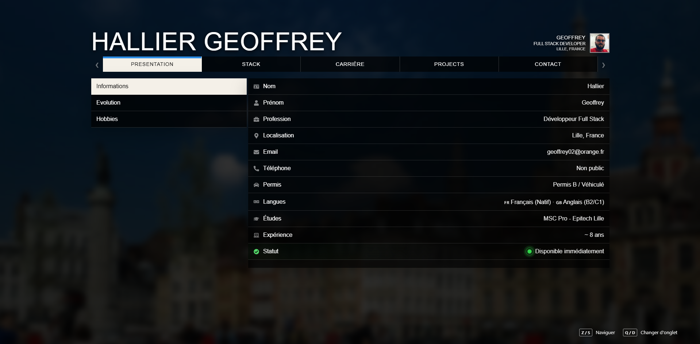

# 🎮 Portfolio — Geoffrey Hallier

<p align="center">
  <strong>Développeur Full Stack</strong><br>
  React • Node.js • GraphQL • MongoDB
</p>

<p align="center">
  Portfolio personnel inspiré de l'interface de <strong>Grand Theft Auto V</strong>, avec une introduction cinématique 3D et une navigation reprenant les codes du menu pause du jeu.
</p>

<p align="center">
  <a href="https://geoffh02.github.io/gta-portfolio/">
    
  </a>

  <a href="https://github.com/GeoffH02/gta-portfolio">
    
  </a>

  <a href="https://www.linkedin.com/in/geoffrey-hallier-8ab971231/">
    
  </a>
</p>

---

## 🎬 Aperçu

<p align="center">
  <a href="https://geoffh02.github.io/gta-portfolio/">
    
  </a>
</p>

<p align="center">
  <strong>Cliquez sur l'image pour ouvrir le portfolio.</strong>
</p>

Le portfolio reprend volontairement l'identité visuelle des menus de GTA V afin de proposer une expérience différente d'un portfolio développeur classique.

La navigation permet de découvrir mon profil, mon parcours professionnel, mes compétences techniques ainsi que les différents projets sur lesquels j'ai travaillé.

---

## 🌍 Introduction cinématique

<p align="center">
  
</p>

L'arrivée sur le portfolio commence par une animation inspirée des transitions de **Grand Theft Auto V**.

La caméra part d'une vue globale avant de se rapprocher progressivement de **Lille**, puis laisse place à l'interface principale du portfolio.

Cette séquence est réalisée avec **CesiumJS** et son moteur de visualisation 3D.

---

## 🕹️ Navigation

Le portfolio reprend le fonctionnement d'un menu pause de jeu.

Il est organisé autour de cinq sections principales :

| Section             | Contenu                                                       |
| ------------------- | ------------------------------------------------------------- |
| 👤 **Présentation** | Informations personnelles, évolution, hobbies et localisation |
| 💻 **Stack**        | Frontend, backend, bases de données et outils                 |
| 💼 **Carrière**     | Parcours professionnel et expériences                         |
| 🚀 **Projects**     | Présentation détaillée de mes principaux projets              |
| ✉️ **Contact**      | Contact, QR codes et CV                                       |

La navigation peut également être effectuée au clavier :

```text
Z / S  → Naviguer dans le menu
Q / D  → Changer d'onglet
```

---

# 💻 Stack technique

## Frontend

<p>
  
</p>

Développement d'interfaces modernes, responsives et orientées expérience utilisateur.

Technologies principales :

- React
- Vue.js
- JavaScript
- TypeScript
- HTML / CSS
- Tailwind CSS
- Material UI
- Bootstrap
- Vite
- Next.js

---

## Backend

<p>
  
</p>

Développement d'API, d'applications métier, de plateformes et de systèmes temps réel.

Technologies principales :

- Node.js
- Express
- NestJS
- REST API
- GraphQL
- WebSocket
- MongoDB
- Mongoose
- SQL
- MySQL

---

## Tests & outils

<p>
  
</p>

J'utilise également régulièrement :

- Git
- GitHub
- GitLab
- Docker
- Linux
- PM2
- Playwright
- Jest
- VS Code
- Postman
- npm
- Yarn
- Figma
- Notion
- OVH

---

# 🚀 Projets présentés

Le portfolio contient plusieurs projets personnels et professionnels permettant de présenter différents aspects de mon expérience.

---

## 🤖 TF2 Trading Helper

Plateforme Full Stack développée afin de centraliser et automatiser mon activité de trading sur **Team Fortress 2**.

### Fonctionnalités principales

- Gestion de plusieurs bots Steam
- Surveillance du marché Backpack.tf
- Détection d'opportunités de trading
- WebSockets et synchronisation temps réel
- Gestion des listings
- Surveillance des changements de prix
- Pricing automatique
- Détection des meilleurs buy orders
- Systèmes d'outbid
- Gestion des inventaires
- Historique des échanges
- Suivi des utilisateurs
- Statistiques
- Monitoring des bots
- Dashboard d'administration centralisé

### Technologies

`React` `Node.js` `Express` `MongoDB` `WebSocket`

---

## 🏃 Kobi Sport

Projet professionnel autour de plateformes sport et bien-être destinées aux environnements **B2B et B2C**.

J'étais principalement en charge de la partie frontend web et d'une grande partie de l'évolution des différentes interfaces.

### Missions

- Développement frontend B2C
- Développement frontend B2B
- Dashboard entreprise
- Dashboard interne
- Dashboard club
- Création de maquettes avec Figma
- Intégration des designs
- Développement du système de challenges sportifs
- Challenges de pas
- Challenges vélo
- Challenges squats
- Maintenance des schémas GraphQL
- Optimisation des appels GraphQL
- Mise en place de Playwright sur les différentes plateformes
- Gestion des tickets via Notion
- Rendez-vous avec les clients
- Recherche d'axes d'amélioration produit
- Travail en méthodologie Scrum
- Réunions quotidiennes de suivi
- Planification des sprints toutes les deux semaines

### Technologies

`React` `TypeScript` `GraphQL` `Playwright` `Figma` `Notion`

> 🔒 Les plateformes et dashboards concernés étant privés, leurs interfaces et données ne peuvent pas être présentées publiquement pour des raisons de confidentialité.

### Site officiel

https://www.kobisport.eu/

---

## 🛒 Quicksell.store

Marketplace et plateforme de trading sur laquelle j'ai travaillé aussi bien sur la partie frontend que sur une partie importante du backend.

### Missions

- Refonte complète de l'ancien design
- Migration du frontend vers React
- Développement backend
- Développement d'un nouvel algorithme de pricing
- Ajustement automatique des offres d'achat
- Ajustement automatique des offres de vente
- Conservation d'une marge de profit prédéfinie
- Connexion de l'API à plusieurs plateformes externes
- Augmentation de la couverture du marché
- Mise en place des tests E2E avec Playwright
- Mise en place des tests unitaires avec Jest

Le système de pricing permet de conserver des offres compétitives tout en respectant une marge minimale configurée.

### Technologies

`React` `Node.js` `MongoDB` `Playwright` `Jest`

### Site officiel

https://quicksell.store/

---

## 💳 Virgo Wallet

Wallet crypto développé sous forme d'extension web.

J'ai principalement travaillé sur la conception du produit, les interfaces et l'intégration de nouvelles fonctionnalités.

### Missions

- Design du wallet
- Production des différentes maquettes
- Intégration des interfaces
- Recherche de nouvelles fonctionnalités
- Réflexion autour des améliorations du produit
- Système d'airdrops
- Distribution de tokens lors d'événements
- Envoi de cryptomonnaies
- Réception de cryptomonnaies
- Swap
- Intégration NFT
- Agenda
- Carnet de contacts

### Technologies

`React` `Blockchain` `Web3`

### Site officiel

https://www.virgo.net/

---

## 🏭 Nespoli Group

Application métier développée afin de faciliter la gestion des stocks et des inventaires entre différents ateliers.

### Fonctionnalités principales

- Gestion des inventaires
- Gestion multi-ateliers
- Suivi des pièces disponibles
- Gestion des stocks
- Détection des stocks faibles
- Alertes de stock
- Gestion des seuils minimums
- Automatisation de certaines commandes
- Réapprovisionnement automatique

### Technologies

`PHP` `MySQL` `Bootstrap` `jQuery`

> 🔒 Cette application étant un outil professionnel interne, ses interfaces et données ne peuvent pas être présentées publiquement pour des raisons de confidentialité.

---

# 🎨 Design & expérience utilisateur

Une partie importante du projet a été consacrée à la création d'une interface inspirée de GTA V.

Cela comprend notamment :

- navigation par onglets ;
- sidebar contextuelle ;
- interface sombre et transparente ;
- arrière-plan dynamique ;
- animations d'ouverture ;
- transitions entre les catégories ;
- micro-animations au survol ;
- icônes animées ;
- barres de compétences segmentées ;
- navigation au clavier ;
- indicateurs de statut animés ;
- présentation chronologique du parcours ;
- galeries de projets ;
- carrousels ;
- zoom plein écran sur les captures ;
- lightbox ;
- gestion des projets confidentiels ;
- preview du CV ;
- QR codes ;
- intégration cartographique avec Cesium.

L'objectif n'était pas simplement de reproduire visuellement GTA V, mais d'adapter son langage visuel à un **portfolio de développeur**.

---

# 🗺️ CesiumJS

L'introduction du portfolio utilise **CesiumJS**.

La caméra suit plusieurs étapes avant d'arriver sur la zone géographique associée au portfolio.

```text
Vue globale
     ↓
France
     ↓
Nord de la France
     ↓
Lille
     ↓
Portfolio
```

La transition combine différentes :

- coordonnées ;
- altitudes ;
- inclinaisons ;
- durées ;
- animations de caméra.

Le token Cesium Ion est fourni au projet via une variable d'environnement afin de ne pas être directement stocké dans le code source.

---

# ✨ Fonctionnalités du portfolio

Le portfolio comprend notamment :

- 🎮 Interface inspirée de GTA V
- 🌍 Introduction 3D avec Cesium
- ⌨️ Navigation clavier
- 📊 Barres de compétences animées
- 🖱️ Micro-animations au hover
- 🧩 Animations différentes selon les icônes
- 🕒 Présentation chronologique
- 🚀 Pages détaillées pour les projets
- 🖼️ Galeries de captures
- 🔍 Zoom sur les images
- ⬅️ ➡️ Navigation dans les galeries
- 🟢 Statuts animés
- 🔒 Gestion des projets confidentiels
- 📄 Preview du CV
- 📥 Téléchargement du CV
- 📱 QR codes vers mes différents profils
- 🗺️ Carte
- 📱 Interface responsive

---

# 📁 Structure du projet

```text
gta-portfolio/
├── .github/
│   └── workflows/
│
├── public/
│
├── src/
│   ├── pages/
│   │   ├── Career/
│   │   ├── Contact/
│   │   ├── Home/
│   │   ├── Intro/
│   │   ├── Portfolio/
│   │   ├── Projects/
│   │   └── Stack/
│   │
│   └── styles/
│       ├── cv/
│       ├── img/
│       │   ├── projects/
│       │   │   ├── Quicksell/
│       │   │   ├── TF2/
│       │   │   └── Virgo/
│       │   │
│       │   └── readme/
│       │       ├── intro.gif
│       │       └── portfolio-preview.png
│       │
│       └── index.css
│
├── .env
├── .gitignore
├── index.html
├── package.json
├── package-lock.json
├── README.md
└── vite.config.js
```

---

# ⚙️ Installation

Clonez le repository :

```bash
git clone https://github.com/GeoffH02/gta-portfolio.git
```

Accédez au projet :

```bash
cd gta-portfolio
```

Installez les dépendances :

```bash
npm install
```

---

# 🔐 Configuration

L'introduction utilise Cesium Ion.

Créez un fichier `.env` à la racine du projet :

```env
VITE_CESIUM_ION_TOKEN=your_cesium_ion_token
```

Le token ne doit pas être ajouté directement au repository.

---

# 🧪 Développement

Lancez le serveur Vite :

```bash
npm run dev
```

Vite affichera ensuite l'adresse locale du portfolio.

---

# 🏗️ Build

Pour générer la version destinée à la production :

```bash
npm run build
```

Le résultat est généré dans :

```text
dist/
```

Pour tester le build localement :

```bash
npm run preview
```

---

# 🚀 Déploiement

Le portfolio est disponible publiquement ici :

### 🌐 https://geoffh02.github.io/gta-portfolio/

Le déploiement est automatisé grâce à **GitHub Actions** et **GitHub Pages**.

Le processus suit globalement cette logique :

```text
Push sur master
      │
      ▼
GitHub Actions
      │
      ├── Checkout
      ├── Setup Node.js
      ├── npm ci
      ├── npm run build
      │
      ▼
     dist/
      │
      ▼
GitHub Pages
```

Le token Cesium est fourni au build grâce au secret GitHub :

```text
VITE_CESIUM_ION_TOKEN
```

---

# 👨‍💻 Geoffrey Hallier

**Développeur Full Stack**

Principalement orienté :

`React` • `Node.js` • `GraphQL` • `MongoDB`

Avec une attention particulière portée aux :

- interfaces ;
- applications métier ;
- dashboards ;
- automatisations ;
- performances ;
- expériences utilisateur.

### 🔗 Liens

- 🌐 [Portfolio](https://geoffh02.github.io/gta-portfolio/)
- 💻 [GitHub](https://github.com/GeoffH02)
- 📦 [Repository du portfolio](https://github.com/GeoffH02/gta-portfolio)
- 💼 [LinkedIn](https://www.linkedin.com/in/geoffrey-hallier-8ab971231/)

---

# 📄 Crédits

Ce repository contient mon portfolio personnel.

**Grand Theft Auto V**, GTA V et les éléments associés à la franchise appartiennent à leurs détenteurs respectifs.

Ce portfolio est un projet personnel inspiré de l'univers visuel du jeu et n'est **ni affilié, ni sponsorisé, ni approuvé par Rockstar Games ou Take-Two Interactive**.

Les marques, logos et contenus associés aux entreprises et projets présentés restent la propriété de leurs détenteurs respectifs.

---

<div align="center">

### 🎮 GAME ON

**Designed & developed by Geoffrey Hallier**

`React` • `Vite` • `CesiumJS`

<br>

[🌐 Portfolio](https://geoffh02.github.io/gta-portfolio/) •
[💻 GitHub](https://github.com/GeoffH02) •
[💼 LinkedIn](https://www.linkedin.com/in/geoffrey-hallier-8ab971231/)

</div>
